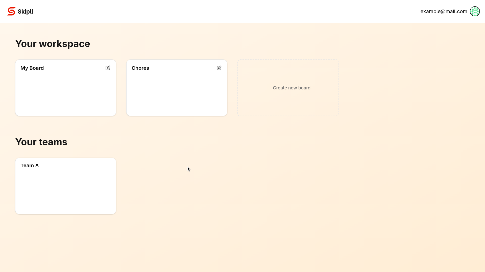
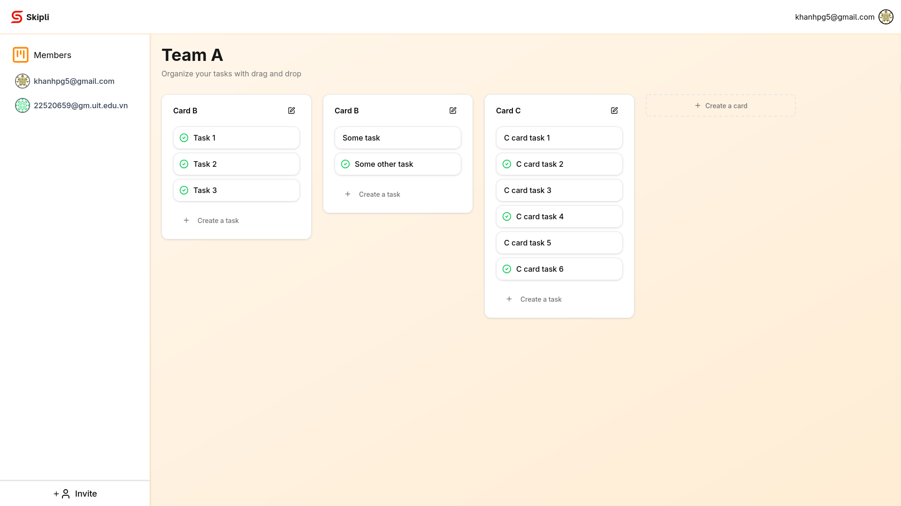

# Real-Time Board Management Tool

[](https://raw.githubusercontent.com/Schiffer116/skipli/master/demo.mp4)

## Overview

This project is a **real-time board management tool** that allows teams to collaborate on tasks and cards. Features include:

- Multi-user support with authentication
- Board, Card and Task creation, updates, deletion
- Drag-and-drop task management
- Real-time updates via WebSockets
- Invite members to boards with email notifications

## Tech Stack

- **Frontend**: React, TypeScript, TailwindCSS
- **Backend**: Node.js, Express, TypeScript
- **Realtime**: Socket.IO
- **Authentication**: JWT tokens, email verification

## Running the app

1. Clone the repository:

```bash
git clone https://github.com/Schiffer116/skipli.git
cd skipli
```

1. Install dependencies:

```bash
pnpm install
```

1. Configure environment variables:

Create a `.env` file in the root with Firebase and GitHub credentials:

```env
FIREBASE_DB_URL=your-firebase-db-url
GOOGLE_APPLICATION_CREDENTIALS=your-google-application-credentials
APP_EMAIL=your-app-email@example.com
APP_EMAIL_PASSWORD=your-app-email-password
JWT_SECRET=a-string-secret-at-least-256-bits-long
```

1. Build and run:

```bash
pnpm build
pnpm start
```

## Screenshots



