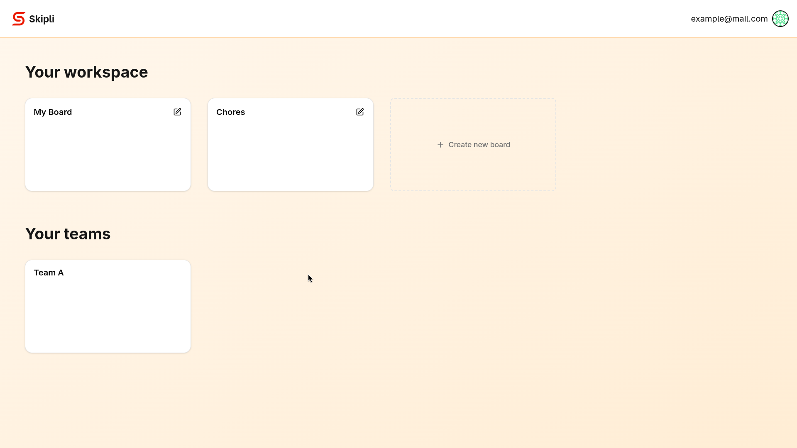
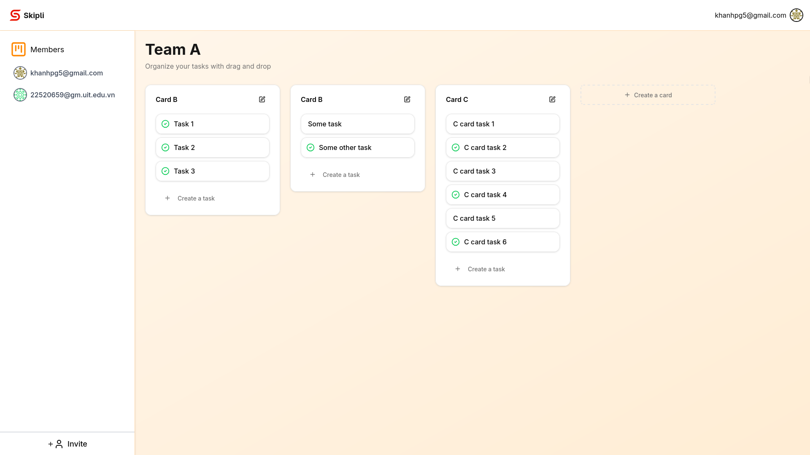

# Real-Time Board Management Tool


## Overview

This project is a **real-time board management tool** that allows teams to collaborate on tasks and cards. Features include:

- Multi-user support with authentication
- Board, Card and Task creation, updates, deletion
- Drag-and-drop task management
- Real-time updates via WebSockets
- Invite members to boards with email notifications

## Tech Stack

- **Frontend**: React, TypeScript, TailwindCSS (`ui/`)
- **Backend**: Go, DynamoDB (`app/`)
- **Infrastructure**: AWS CloudFormation: S3 + CloudFront, Lambda, DynamoDB (`infra/`)

## Running locally

1. Clone the repository:

```bash
git clone https://github.com/Schiffer116/skipli.git
cd skipli
```

1. Configure the API's environment (AWS credentials come from the usual
   AWS CLI config/profile; the table is `Skipli` in `ap-southeast-7`):

```bash
export APP_EMAIL=your-app-email@example.com
export APP_EMAIL_PASSWORD=your-app-email-password
export JWT_SECRET=a-string-secret-at-least-256-bits-long
```

1. Start the API (port 3000, override with `PORT`):

```bash
cd app && make run
```

1. Start the frontend (proxies `/api` to the API, override with `API_URL`):

```bash
cd ui && pnpm install && pnpm dev
```

## Deploying

With the same environment variables set and AWS credentials for the target
account:

```bash
./infra/deploy.sh
```

This deploys `infra/template.yaml`: the frontend on S3 behind CloudFront and
the API on Lambda under `/api/*` on the same domain. It reuses an existing
`Skipli` table by default; set `CREATE_TABLE=true` to have the stack create
it. `STACK_NAME` and `AWS_REGION` are also configurable.

## Screenshots



