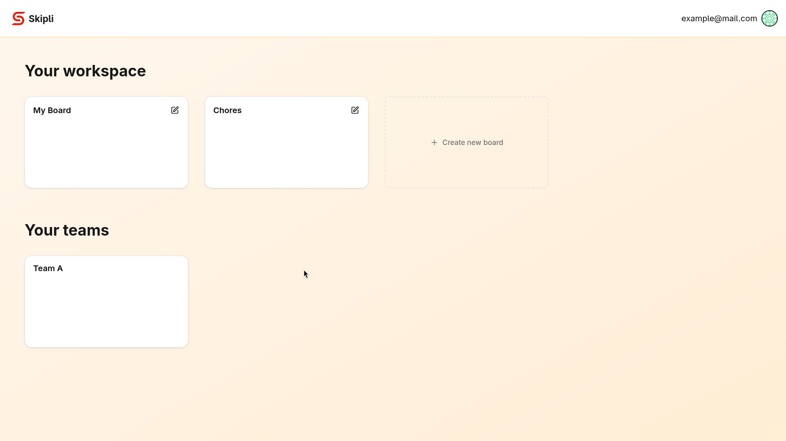
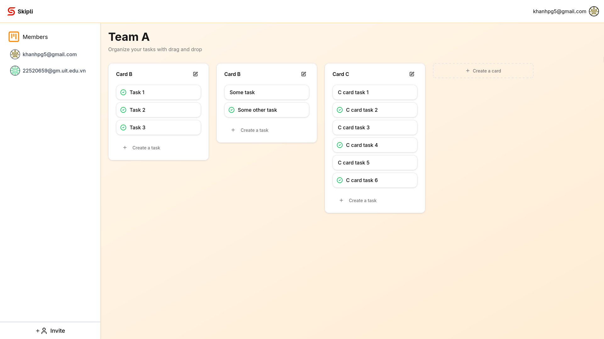

# Real-Time Board Management Tool


## Overview

This project is a **real-time board management tool** that allows teams to collaborate on tasks and cards. Features include:

- Multi-user support with authentication
- Board, Card and Task creation, updates, deletion
- Drag-and-drop task management
- Real-time updates via WebSockets
- Invite members to boards with email notifications

## Tech Stack

- **Frontend**: React, TypeScript, TailwindCSS (`ui/`)
- **Backend**: Go, DynamoDB (`app/`)
- **Infrastructure**: AWS CloudFormation: S3 + CloudFront, Lambda, DynamoDB (`infra/`)

## Running locally

1. Clone the repository:

```bash
git clone https://github.com/Schiffer116/skipli.git
cd skipli
```

1. Configure the API's environment (AWS credentials come from the usual
   AWS CLI config/profile; the table is in `ap-southeast-7`):

```bash
export APP_EMAIL=your-app-email@example.com
export APP_EMAIL_PASSWORD=your-app-email-password
export JWT_SECRET=a-string-secret-at-least-256-bits-long
export TABLE_NAME=Skipli
```

1. Start the API (port 3000, override with `PORT`):

```bash
cd app && make run
```

1. Start the frontend (proxies `/api` to the API, override with `API_URL`):

```bash
cd ui && pnpm install && pnpm dev
```

## Deploying

With the same environment variables set and AWS credentials for the target
account:

```bash
./infra/deploy.sh
```

This deploys `infra/template.yaml`: the frontend on S3 behind CloudFront and
the API on Lambda under `/api/*` on the same domain. It reuses an existing
`Skipli` table by default; set `CREATE_TABLE=true` to have the stack create
it. `STACK_NAME` and `AWS_REGION` are also configurable.

The site is served at `https://skipli.schifferarchitecture.com`: the script
issues its certificate in `us-east-1` (`infra/certificate.yaml`, as CloudFront
requires) and creates the DNS records in the domain's Route 53 zone. Set
`DOMAIN_NAME` to use another domain, or to an empty string for none.

## CI/CD

`.github/workflows/pipeline.yml` runs on every push and pull request:
frontend lint + typecheck + build, backend `gofmt`/`vet`/`test`/Lambda build, and
lint for the CloudFormation templates and deploy script. Pushes to `master`
that pass then deploy with `infra/deploy.sh`.

The deploy job authenticates to AWS with GitHub OIDC, so no AWS keys are
stored in GitHub. One-time setup:

1. Deploy the bootstrap stack (set `CreateOidcProvider=false` if the account
   already has a `token.actions.githubusercontent.com` identity provider):

```bash
aws cloudformation deploy --region ap-southeast-7 \
  --stack-name skipli-pipeline \
  --template-file infra/pipeline.yaml \
  --capabilities CAPABILITY_NAMED_IAM
aws cloudformation describe-stacks --region ap-southeast-7 \
  --stack-name skipli-pipeline --query 'Stacks[0].Outputs'
```

1. In the GitHub repository, create an environment named `production` and
   add to it:
   - variables `AWS_DEPLOY_ROLE_ARN` and `AWS_CFN_ROLE_ARN` (the two outputs)
   - secrets `APP_EMAIL`, `APP_EMAIL_PASSWORD` and `JWT_SECRET`

## Screenshots



